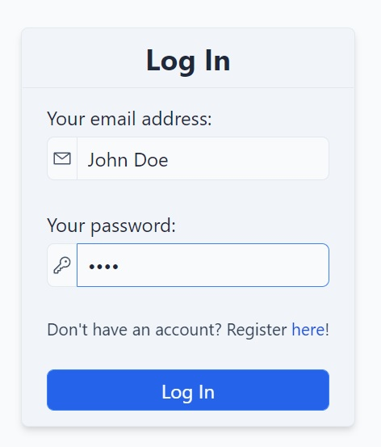
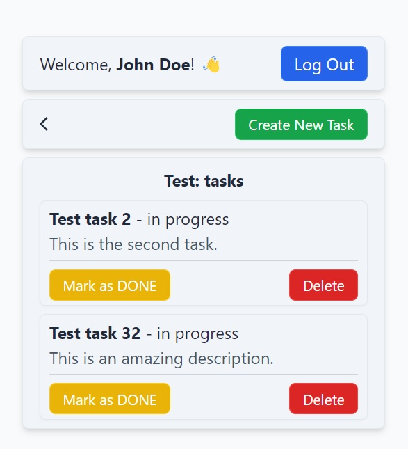

# Advanced Todo Application
This is an advanced and over-engineered full-stack **to-do application**, with a full **login system**.  
This app helps you to create lists, and manage your tasks inside these lists.  
You can also create different accounts and login if you want to.
<p>
    
    
</p>

<hr>

## Tech Stack
- Frontend: 
  - React
  - TypeScript
  - React Router
  - Tailwind
  - React Icons
  - Axios
- Backend:
  - Golang
  - Gin
  - Gorm
  - Go JWT
- Backend documentation:
  - Swagger
- Database:
  - MySQL

<hr>

## Running with docker
Firstly, make sure you have **Docker** installed.  
Then you can **clone** this repo and run the app with `docker-compose`:
```sh
git clone https://github.com/0l1v3rr/todo.git
cd todo
docker-compose up
```
Make sure you changed the **environment variables** in the `docker-compose` file.  
If the running is successful, you will find the **app** running on port `3000`.  
The **backend** will run on port `8080`.  
**Important**: you can find the swagger documentation running here: `localhost:8080/swagger/index.html`

<hr>

## Building and running from source
If you have successfully cloned this **repository**, make the project's root folder active in your terminal.  

### Backend
You will find the **backend** in the `/app` directory.  
**Before you can run the app**, you have to create here a `.env` file, with these parameters:
```env
PORT=8080
FRONTEND=http://localhost:3000
MYSQL_USERNAME=root
MYSQL_PASSWORD=root
MYSQL_DOMAIN=127.0.0.1
MYSQL_PORT=3306
MYSQL_DATABASE=todo
JWT_SECRET=secret
```
Of course, you will need to change the necessary values.  
<br>
Now you can run this easily with one command:
```sh
make run
```

### Frontend
You will find the **frontend** in the `/view` directory.  
If you run the frontend the first time, you need to specify one command before running it:  
```sh
npm i
```
Now you can run the frontend:
```sh
npm start
```

<hr>

## License
[MIT](https://opensource.org/licenses/MIT)